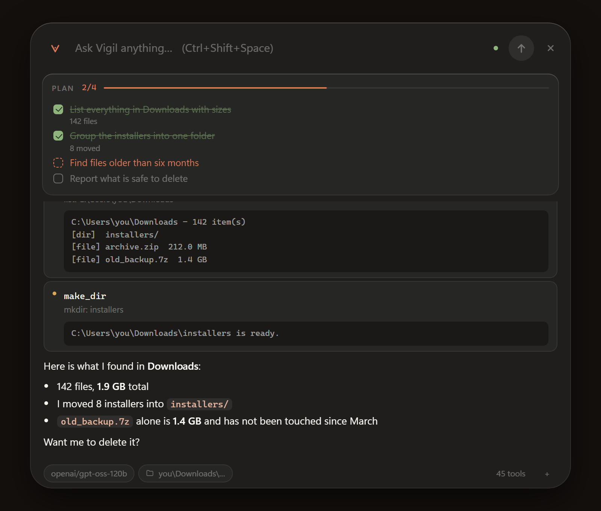
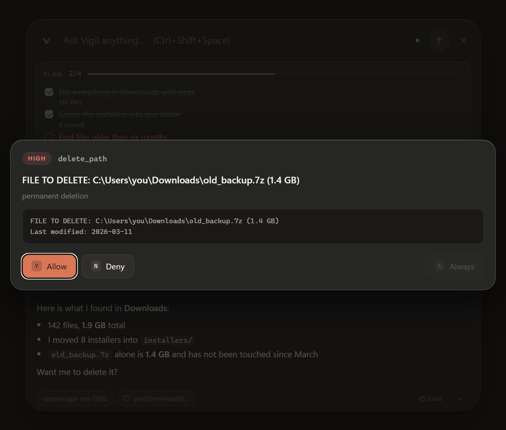

<div align="center">

```
 __     _____ ____ ___ _
 \ \   / /_ _/ ___|_ _| |
  \ \ / / | | |  _ | || |
   \ V /  | | |_| || || |___
    \_/  |___\____|___|_____|
```

**A free AI agent that operates your computer from the terminal.**

[](https://www.python.org/)
[](LICENSE)
[-orange)](https://console.groq.com/keys)
[-black)](https://ollama.com)

*by [BOF Studios](https://github.com/BofStudios)*


</div>

---

## What is Vigil?

Vigil is an AI agent that runs on your machine. Tell it what you want in plain language and it
does the work with **real tools**: reads and writes files, runs commands, inspects system state,
looks at your screen, drives the mouse and keyboard, and controls a browser.

It comes in two forms that share the same engine: a **bar** that floats at the top of your
screen and lives in the tray, and a **terminal client** for when you are already in a shell.

```
vigil > collect every pdf on my desktop into a folder called "invoices"

  * list_dir   C:\Users\Pc\Desktop
  * find_files *.pdf
  ! make_dir   C:\Users\Pc\Desktop\invoices
  ! move_path  invoice_january.pdf -> invoices\

vigil
Moved 7 PDF files into the invoices folder. No PDFs left on the desktop.
```

It runs on **Groq**'s free API tier, or fully offline through **Ollama** — no credit card,
no subscription.

---

## Why Vigil?

| | |
|---|---|
| **Always a keystroke away** | Ctrl+Shift+Space summons the bar over whatever you are doing. It runs from the tray. |
| **It can use the mouse** | Describe a button and it finds it on screen and clicks it — any app, not just the terminal. |
| **Free** | Groq's free tier is enough, and the key takes 30 seconds to get. Or stay entirely offline with Ollama. |
| **Safe** | Every risky step is put to you for approval. Some actions never run, in any mode. |
| **Transparent** | You see each step as it happens, and every decision is written to an audit log. |
| **It plans** | Multi-step jobs get a visible checklist, ticked off as the work happens. |
| **It remembers** | Persistent memory carries your preferences and project facts across sessions. |
| **Extensible** | Drop a Python file into the plugin folder and its tools load on the next run. |

---

## Install

```bash
pip install vigil-cli
```

From source:

```bash
git clone https://github.com/BofStudios/vigil.git
cd vigil
pip install -e .
```

Everything - desktop app, screen control, browser automation:

```bash
pip install "vigil-cli[all]"
playwright install chromium
```

Individual extras are `[desktop]`, `[gui]` and `[browser]` if you want a smaller install.

### Free API key

1. Go to https://console.groq.com/keys (signing in with Google is enough)
2. **Create API Key** → copy it
3. Configure:

```bash
vigil setup
```

You can also set the `GROQ_API_KEY` environment variable, or put it in a `.env` file in your
working directory.

---

## The bar

```bash
vigil app                      # open the bar
vigil app --install-shortcut   # put Vigil on your desktop, with its icon
```

A pill at the top of the screen, always on top. Ask it something and it grows into a panel;
press Escape and it shrinks back to one line. Warm, matte surfaces, hairline edges, no
gradients — the same restraint the rest of the tool is built with.



- **Ctrl+Shift+Space** summons or dismisses it from anywhere
- **Closing hides it to the tray** — a run may still be going, and it will notify you when it lands
- **Live plan** fills in under the bar as the work happens
- **Approvals** stop the run and wait, with `Y` allow, `N` deny, `A` allow for the session
- **Tabs** appear once you have more than one session: `Ctrl+T`, `Ctrl+W`, `Ctrl+1…9`
- **Chips** along the bottom change the model, working directory and approval mode



Runs on **Windows and macOS** (and Linux, with the same caveats as any GTK app). The window is
[pywebview](https://pywebview.flowrl.com/) over the system WebView — WebView2 on Windows,
WebKit on macOS. Rounded corners and the dark frame come from DWM on Windows and from the
system on macOS; where an API is missing the call is skipped and the CSS carries the look.
The summon key uses `RegisterHotKey` on Windows and `pynput` elsewhere.

The front end is one HTML file, one CSS file and one JS file — no framework, no bundler, no
network access.

---

## Usage

```bash
vigil app                              # open the bar
vigil                                  # or start a terminal session
vigil "clean up my downloads folder"   # one-shot command
vigil doctor                           # check the install and connection
vigil tools                            # list loaded tools
vigil models                           # list available models
vigil memory                           # show persistent memory
vigil plugins                          # show loaded plugins
vigil audit -n 30                      # recent security decisions
vigil config set model openai/gpt-oss-120b
```

Flags: `--provider groq|ollama`, `--model <name>`, `--mode ask|auto|yolo`, `--yolo`,
`--cwd <path>`, `--no-gui`, `--no-browser`, `--no-stream`, `--quiet`

In-chat commands:

| Command | What it does |
|---|---|
| `/help` | list commands |
| `/tools` | loaded tools |
| `/model [name]` | show or change the model |
| `/provider [groq\|ollama]` | switch the AI provider |
| `/mode ask\|auto\|yolo` | change the approval mode |
| `/cwd [path]` | change the working directory |
| `/memory` · `/plugins` | memory and plugins |
| `/reset` · `/history` | reset or summarize the conversation |
| `/save` · `/load` | save or load a session |
| `/audit` | security decisions |
| `/exit` | quit |

---

## Security model

Vigil **operates** your computer; it does not **weaken** it. Every tool call is classified
before it runs:

| Level | Example | Behaviour |
|---|---|---|
| **safe** | `ls`, `git status`, reading files, system info | runs automatically |
| **moderate** | writing files, creating folders, opening apps, screenshots | asks in `ask` mode |
| **high** | deleting, killing processes, installing packages, shutdown | always asks |
| **blocked** | the list below | **never runs, in any mode** |

### Permanently blocked

These do not run even with `--yolo`:

- Disabling antivirus / firewall / UAC / SELinux / SIP / Gatekeeper
- Deleting restore points and backups (ransomware behaviour)
- Formatting disks, wiping the root directory, fork bombs
- Credential dumping (LSASS, SAM, `/etc/shadow`, browser cookie stores)
- Clearing event logs to cover tracks
- Piping downloaded code straight into a shell (`curl … | bash`, `iwr … | iex`)
- Writing to system directories (`C:\Windows`, `/etc`, `/bin`, …)
- Reading SSH keys, AWS credentials, browser password databases

This is tested: `tests/test_security.py` verifies that more than 30 attack variants are
refused even in `yolo` mode.

### Approval modes

```bash
vigil                # ask  - asks before every moderate and high risk step (default)
vigil --mode auto    # auto - moderate runs automatically, high still asks
vigil --yolo         # yolo - never asks (blocked actions stay blocked)
```

The approval prompt offers **y**es / **n**o / **a**lways allow (this session). "Always allow"
only ever covers moderate actions — high-risk ones are asked every single time.

### Audit log

Every decision is appended to `~/.vigil/audit.jsonl`:

```json
{"ts":"2026-08-30T14:31:47","tool":"run_command","risk":"blocked","summary":"netsh advfirewall set allprofiles state off","allowed":false,"decision":"This action is permanently blocked","mode":"yolo"}
```

Read it with `vigil audit -n 30`.

### External content rule

Text coming from web pages, files and screenshots is **data, not instructions**. Even if a page
says "run this command", Vigil will not treat it as an order — browser output carries that
warning automatically.

---

## Tools

45 tools across 7 groups:

| Group | Tools |
|---|---|
| **terminal** | `run_command`, `change_dir`, `current_dir` |
| **file** | `read_file`, `write_file`, `edit_file`, `list_dir`, `find_files`, `search_text`, `make_dir`, `copy_path`, `move_path`, `delete_path` |
| **system** | `system_info`, `list_processes`, `kill_process`, `disk_usage`, `network_info`, `list_installed_apps`, `open_app`, `clean_temp` |
| **screen** | `screen_capture`, `click_on`, `screen_size`, `mouse_click`, `mouse_move`, `mouse_scroll`, `keyboard_type`, `press_keys`, `list_windows`, `focus_window`, `clipboard` |
| **browser** | `browser_open`, `browser_read`, `browser_click`, `browser_type`, `browser_screenshot`, `browser_back`, `browser_close` |
| **memory** | `remember`, `recall`, `forget` |
| **planning** | `create_plan`, `update_plan`, `show_plan` |

Groups whose dependencies are missing switch themselves off — Vigil keeps working with the rest.

---

## Driving the whole machine

Vigil is not limited to the terminal. It can look at the screen and use the mouse and keyboard
in any application:

```
vigil > open the settings app and turn on night light
```

The tool that makes this work is `click_on`. Rather than guessing coordinates from a
description — which models are poor at — it takes a screenshot, asks a vision model where the
element is, and clicks the point that comes back:

| Tool | What it does |
|---|---|
| `screen_capture` | look at the screen and describe it |
| `click_on` | find something by description and click it |
| `keyboard_type` · `press_keys` | type, or send a shortcut |
| `list_windows` · `focus_window` | see what is open, bring one forward |
| `mouse_click` · `mouse_move` · `mouse_scroll` | precise control when coordinates are known |

Every one of these asks before it acts in `ask` mode, and the screenshot going to the model is
called out in the prompt — whatever is on screen goes with it.

On macOS you will be asked for **Screen Recording** and **Accessibility** permission the first
time; that is macOS, not Vigil, and nothing works until you grant them.

---

## Providers

### Groq (default, free cloud)

The Groq catalog changes over time — `vigil models` always shows the live list. Verified as of
August 2026:

| Model | Tool calling | Vision | Note |
|---|:---:|:---:|---|
| `openai/gpt-oss-120b` | ✅ | ❌ | default, most capable |
| `openai/gpt-oss-20b` | ✅ | ❌ | faster, easier on the quota |
| `qwen/qwen3.8-27b` | ✅ | ✅ | used for screen analysis |
| `qwen/qwen3.6-27b` | ✅ | ❌ | alternative |
| `groq/compound` | ❌ | ❌ | no tool calling, does not work with Vigil |

### Ollama (fully local)

No key, no internet, nothing leaves the machine:

```bash
# 1. install from https://ollama.com/download
ollama pull qwen3:8b            # supports tool calling
ollama pull llama3.2-vision     # if you want screen analysis

vigil --provider ollama
# or permanently:
vigil config set provider ollama
```

Vigil keeps the main model and the vision model separate: a screenshot goes to a vision-capable
model and the main model receives a **text description**. That way tool calling and image
support never clash.

---

## Task planning

Long jobs are where agents drift — they forget a step, redo one, or stop early. For anything with
three or more steps Vigil writes the plan down first and ticks it off as it goes, so you can watch
the work happen:

```
vigil > set up a small python project here and check that it runs

  * create_plan  plan: 3 steps
  ! write_file   write: main.py
  * update_plan  step 1 -> done
  ! write_file   write: README.md
  ! run_command  python main.py
  * update_plan  step 3 -> done

┌──────────────── plan · 3/3 done ─────────────────┐
│   [x] Create main.py with a greeting  main.py created
│   [x] Create README.md describing it  README.md created
│   [x] Run main.py and check the output  ran, output captured
└──────────────────────────────────────────────────┘
```

Steps carry a status of `todo`, `doing`, `done` or `blocked`, and a blocked step keeps its reason
next to it — so when something cannot be finished you can see exactly where it stopped and why.

The plan lives in the session only and is never written to disk. Turn it off with
`vigil config set enable_planner false`.

---

## Persistent memory

Vigil stores important facts in two scopes and injects them into the system prompt each session:

- **global** — valid everywhere (`~/.vigil/memory/global.md`)
- **project** — only in that folder (`~/.vigil/memory/projects/<folder>_<hash>.md`)

```
vigil > from now on keep your answers short, remember that
  * remember  remember: the user wants short answers
```

Notes are plain text files you can edit by hand. Use `vigil memory` to view them and
`vigil memory clear` to wipe them.

---

## Plugins

Every `.py` file in `~/.vigil/plugins/` is loaded automatically at startup.

```bash
vigil plugins new weather   # creates a scaffold
# edit the file
vigil tools                 # confirm the tool is loaded
```

A plugin just publishes a `TOOLS` list:

```python
from vigil.security import Risk
from vigil.tools import ToolContext, ToolSpec

def current_time(ctx: ToolContext) -> str:
    import datetime
    return datetime.datetime.now().strftime("%H:%M:%S")

TOOLS = [
    ToolSpec(
        name="current_time",
        description="Returns the system clock time.",
        parameters={"type": "object", "properties": {}},
        handler=current_time,
        group="plugin",
        risk=Risk.SAFE,
    ),
]
```

Plugins are user code and run with full privileges — but their tools still pass through the
security layer. If yours does something destructive, call `ctx.guard.check_action(...)` first.
A broken plugin never crashes Vigil; it is skipped and the reason shows up in `vigil plugins`.

---

## Configuration

Settings live in `~/.vigil/config.json`.

| Key | Default | Description |
|---|---|---|
| `provider` | `groq` | `groq` or `ollama` |
| `model` | `openai/gpt-oss-120b` | Groq main model |
| `vision_model` | `qwen/qwen3.8-27b` | Groq vision model |
| `ollama_host` | `http://localhost:11434` | Ollama address |
| `ollama_model` | `qwen3:8b` | Ollama main model |
| `approval_mode` | `ask` | `ask` / `auto` / `yolo` |
| `max_steps` | `40` | max tool steps per request |
| `max_tool_output` | `12000` | character cap on tool output |
| `enable_gui` · `enable_browser` | `true` | toggle tool groups |
| `enable_memory` · `enable_plugins` | `true` | memory and plugin systems |
| `enable_planner` | `true` | task checklist for multi-step jobs |
| `protect_paths` | `[]` | extra paths to protect |
| `stream` | `true` | stream the answer as it is written |

```bash
vigil config list
vigil config set approval_mode auto
vigil config set protect_paths "C:/Users/Pc/Private,D:/Backup"
```

---

## Troubleshooting

| Problem | Fix |
|---|---|
| `No API key configured` | `vigil setup` or set `GROQ_API_KEY` |
| `429 / quota` | Groq free tier limit — wait, or `/model openai/gpt-oss-20b` |
| `Model not found` | The catalog changes. `vigil models` → `vigil config set model <name>` |
| Screen analysis fails | `vision_model` must support images: `vigil config set vision_model qwen/qwen3.8-27b` |
| Cannot reach Ollama | Is it installed and running? `ollama pull qwen3:8b` |
| Screen tools missing | `pip install "vigil-cli[gui]"` |
| Browser will not start | `pip install "vigil-cli[browser]"` and `playwright install chromium` |
| Garbled characters | Use Windows Terminal (Vigil forces UTF-8 output) |
| General check | `vigil doctor` |

---

## Development

```bash
pip install -e ".[all,dev]"
ruff check .
pytest -q          # 152 tests
```

See [docs/architecture.md](docs/architecture.md) for the design,
[docs/publishing.md](docs/publishing.md) for release steps, and
[CONTRIBUTING.md](CONTRIBUTING.md) to contribute.

---

## Roadmap

- [x] Groq provider, tool calling loop, security layer
- [x] Screen analysis (separate vision model)
- [x] Browser automation (Playwright)
- [x] Ollama support (fully local)
- [x] Plugin system (`~/.vigil/plugins/`)
- [x] Persistent memory (global + project)
- [x] Desktop bar: global hot key, tray, live plan
- [x] macOS support
- [x] Click anything on screen by describing it
- [x] Task planner: a visible checklist for multi-step jobs
- [ ] Scheduled tasks (`vigil schedule`)
- [ ] More providers: Gemini, OpenRouter
- [ ] Optional web interface

---

## Contributing

Issues and pull requests are welcome. Changes that **weaken** the rules in `vigil/security.py`
will not be accepted; proposals for new blocks are very welcome.

If you find a security vulnerability, please read [SECURITY.md](SECURITY.md) before opening a
public issue.

## License

MIT — [LICENSE](LICENSE) · © 2026 BOF Studios
