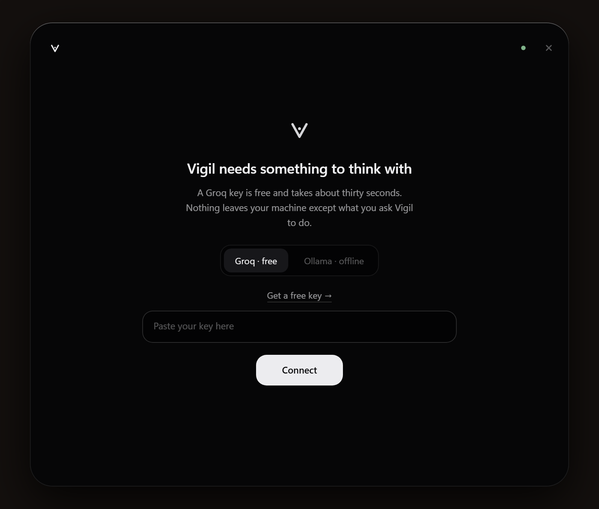
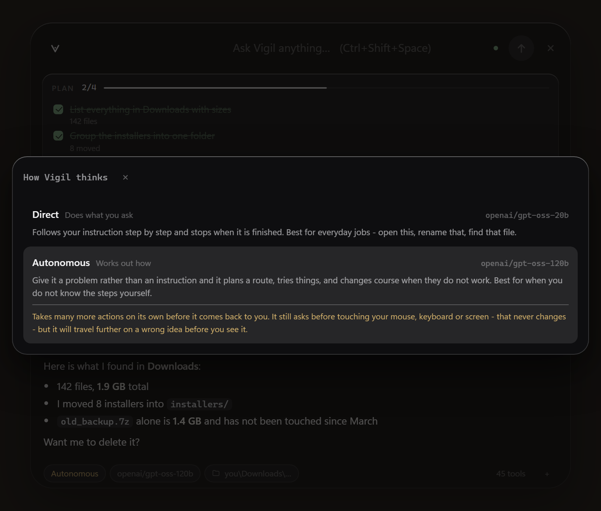

<div align="center">

```
 __     _____ ____ ___ _
 \ \   / /_ _/ ___|_ _| |
  \ \ / / | | |  _ | || |
   \ V /  | | |_| || || |___
    \_/  |___\____|___|_____|
```

**A free AI agent that operates your computer.**

*Download it, open it, paste a free key. No Python, no terminal.*

[](https://github.com/BofStudios/vigil/releases/latest)

[](LICENSE)
[](https://www.python.org/)
[-orange)](https://console.groq.com/keys)
[](https://console.anthropic.com/settings/keys)
[](https://platform.openai.com/api-keys)
[-black)](https://ollama.com)

*by [BOF Studios](https://github.com/BofStudios)*


</div>

---

## What is Vigil?

Vigil is an AI agent that runs on your machine. Tell it what you want in plain language and it
does the work with **real tools**: reads and writes files, runs commands, inspects system state,
looks at your screen, drives the mouse and keyboard, and controls a browser.

It is a **Windows application**. You download it, open it, and paste a free key into the first
screen — Python is inside the app, and there is no terminal anywhere in that path.



There is also a **terminal client** in the same package, for people who are already in a shell.
Both share one engine, one config and one security model.

```
vigil > collect every pdf on my desktop into a folder called "invoices"

  * list_dir   C:\Users\Pc\Desktop
  * find_files *.pdf
  ! make_dir   C:\Users\Pc\Desktop\invoices
  ! move_path  invoice_january.pdf -> invoices\

vigil
Moved 7 PDF files into the invoices folder. No PDFs left on the desktop.
```

It runs on **Groq**'s free API tier, on your own **Claude** or **OpenAI** key, or fully
offline through **Ollama**. The free route needs no credit card and no subscription.

**Vigil is the harness, not the model.** When a lab ships something better at driving a
computer, you point Vigil at it — and it runs behind the same approvals, the same blocked
actions and the same audit log as everything else.

---

## Why Vigil?

| | |
|---|---|
| **Always a keystroke away** | Ctrl+Shift+Space summons the bar over whatever you are doing. It runs from the tray. |
| **It can use the mouse** | Describe a button and it finds it on screen and clicks it — any app, not just the terminal. A light frames your screen while it does. |
| **Two ways of thinking** | Direct follows your instruction; Autonomous is given a problem and works out the route. You pick, like picking a model. |
| **Circle and ask** | Ctrl+Shift+A, draw around anything on screen, and it tells you what it is. |
| **Recall and paste** | Up walks back through what you asked before. Copy a file in Explorer, paste it in, and it has the path. |
| **Hold a key and talk** | Speech goes to Whisper and lands in the box as text. The mic is only ever open while you hold the key. |
| **Any model, one harness** | Free on Groq, your own Claude or OpenAI key, or fully offline. Anything OpenAI-compatible works too. You choose on the first screen. |
| **It never bypasses your defences** | Disabling antivirus, the firewall, UAC or restore points is permanently blocked — in every mode, on every model. |
| **Safe** | Every risky step is put to you for approval. Some actions never run, in any mode. |
| **Transparent** | You see each step as it happens, and every decision is written to an audit log. |
| **It plans** | Multi-step jobs get a visible checklist, ticked off as the work happens. |
| **It remembers** | Persistent memory carries your preferences and project facts across sessions. |
| **Extensible** | Drop a Python file into the plugin folder and its tools load on the next run. |

---

## Install

### Windows — the application

Download **`Vigil-x.y.z-windows-setup.exe`** from
[the latest release](https://github.com/BofStudios/vigil/releases/latest) and run it.

It installs per-user, into `%LOCALAPPDATA%\Programs\Vigil`, so it never asks for an
administrator. There is a portable `.zip` on the same page if you would rather not install
anything at all — unzip it and run `Vigil.exe`.

Windows 10 or 11. Everything the app needs is inside it, including Python.

### The key, on the first screen

Vigil needs something to think with, and it asks in its own window. Four ways in:

| | | |
|---|---|---|
| **Free** | Groq's free tier, and it stays free | `gpt-oss-20b` and `gpt-oss-120b` — the two the brain picker moves between |
| **Claude** | your own Anthropic key | `claude-sonnet-5`, `claude-opus-5`, `claude-haiku-4.5` |
| **GPT** | your own OpenAI key | `gpt-6-astra`, `gpt-5.2`, `gpt-5.2-mini` |
| **Offline** | nothing leaves the machine | whatever you have pulled with Ollama |

The GPT route also takes a `base_url`, so it reaches anything that speaks the same
API — OpenRouter, a local vLLM, LM Studio, Together:

```bash
vigil config set openai_base_url https://openrouter.ai/api/v1
```

The **Get a key →** link opens the right console for whichever you picked. Paste it, press
**Connect**, and the app fills in without a restart. Nothing is written to disk until that key
has actually answered — a key that is refused says why and leaves the screen up.

### From pip, for developers

```bash
pip install "vigil-cli[all]"
playwright install chromium      # only for the browser tools
```

Individual extras are `[desktop]`, `[gui]`, `[browser]` and `[voice]`. From source:

```bash
git clone https://github.com/BofStudios/vigil.git
cd vigil
pip install -e ".[all]"
```

The `GROQ_API_KEY` environment variable and a `.env` file both still work, and `vigil setup`
configures it from a shell.

### Building the application yourself

```bash
python tools/build_app.py --zip
```

Produces `dist/Vigil/Vigil.exe` and a portable zip beside it. CI builds the same thing plus
the installer on every tag.

---

## The bar

```bash
vigil app                        # open the bar
vigil app --install-shortcut     # put Vigil on your desktop, with its icon
vigil app --autostart on         # and start it when you log in
```

At rest it is a small capsule at the top of the screen holding the mark, and nothing else —
no name, no status dot, nothing moving. Something that sits on your screen all day should not
be talking while it waits. Move the pointer near it and it opens into the bar; ask it
something and it grows into a panel; press Escape and it folds back.


- **The pointer opens it** — no click needed; it folds away again when you leave
- **Ctrl+Shift+Space** summons or dismisses it from anywhere
- **Closing hides it to the tray** — a run may still be going, and it will notify you when it lands
- **Live plan** fills in under the bar as the work happens
- **Approvals** stop the run and wait, with `Y` allow, `N` deny, `A` allow for the session
- **Tabs** appear once you have more than one session: `Ctrl+T`, `Ctrl+W`, `Ctrl+1…9`
- **Chips** along the bottom change how it thinks, the model, working directory and approval mode
- **Up and Down** walk back through what you have asked before, and forward again to whatever you were half-way through typing
- **Paste** understands more than text: a picture goes to the vision model and comes back as words you can edit, and a file copied in Explorer arrives as its path
- **One at a time** — running `vigil app` again brings the bar you already have forward instead of opening a second one


The tray icon carries the state: green while it is working, amber while it is waiting on an
approval you cannot see because the bar is hidden. Idle has no badge at all.

Everything that moves — the light travelling along the mark, rows arriving, controls leaning
towards the pointer — is switched off when your system asks for less movement.

Runs on **Windows and macOS** (and Linux, with the same caveats as any GTK app). The window is
[pywebview](https://pywebview.flowrl.com/) over the system WebView — WebView2 on Windows,
WebKit on macOS. Rounded corners and the dark frame come from DWM on Windows and from the
system on macOS; where an API is missing the call is skipped and the CSS carries the look.
The summon key uses `RegisterHotKey` on Windows and `pynput` elsewhere.

The front end is one HTML file, one CSS file and one JS file — no framework, no bundler, no
network access.

---

## How it thinks

Two ways of working, chosen the way you would choose a model — because it is also choosing
one. The chip in the bar's footer switches between them, or `--brain` on the command line.



| | **Direct** | **Autonomous** |
|---|---|---|
| For | everyday jobs | problems |
| Given | an instruction | a goal |
| Plans | no — the planning tools are not offered | yes, and you watch it fill in |
| Steps | at most 14 | at most 40 |
| Model | `openai/gpt-oss-20b` | `openai/gpt-oss-120b` |

**Direct** follows your instruction step by step and stops when it is done. It takes the
shortest correct route and does not widen the job. This is the default.

**Autonomous** is handed a problem rather than an instruction: it plans a route, tries things,
and changes course when they do not work. Choosing it repeats its warning at the moment you
turn it on — it takes many more actions on its own before it comes back to you.

> **What a brain cannot change is security.** Blocked actions stay blocked, and the mouse,
> keyboard and screen are confirmed every time in both. Autonomous is riskier because it
> *acts* more, not because it *asks* less.

```bash
vigil --brain autonomous "work out why my laptop takes four minutes to boot"
vigil --brain direct "rename every screenshot on my desktop to its date"
```

---

## Usage

```bash
vigil app                              # open the bar
vigil                                  # or start a terminal session
vigil "clean up my downloads folder"   # one-shot command
vigil doctor                           # check the install and connection
vigil tools                            # list loaded tools
vigil models                           # list available models
vigil memory                           # show persistent memory
vigil plugins                          # show loaded plugins
vigil audit -n 30                      # recent security decisions
vigil config set model openai/gpt-oss-120b
```

Flags: `--provider groq|anthropic|openai|ollama`, `--model <name>`, `--brain direct|autonomous`,
`--mode ask|auto|yolo`, `--yolo`, `--cwd <path>`, `--no-gui`, `--no-browser`,
`--no-stream`, `--quiet`

In-chat commands:

| Command | What it does |
|---|---|
| `/help` | list commands |
| `/tools` | loaded tools |
| `/model [name]` | show or change the model |
| `/provider [groq\|anthropic\|openai\|ollama]` | switch the AI provider |
| `/mode ask\|auto\|yolo` | change the approval mode |
| `/brain direct\|autonomous` | change how it thinks |
| `/cwd [path]` | change the working directory |
| `/memory` · `/plugins` | memory and plugins |
| `/reset` · `/history` | reset or summarize the conversation |
| `/save` · `/load` | save or load a session |
| `/audit` | security decisions |
| `/exit` | quit |

---

## Security model

Vigil **operates** your computer; it does not **weaken** it. Every tool call is classified
before it runs:

| Level | Example | Behaviour |
|---|---|---|
| **safe** | `ls`, `git status`, reading files, system info | runs automatically |
| **moderate** | writing files, creating folders, opening apps | asks in `ask` mode |
| **high** | deleting, killing processes, installing packages, shutdown | always asks |
| **blocked** | the list below | **never runs, in any mode** |

### Permanently blocked

These do not run even with `--yolo`:

- Disabling antivirus / firewall / UAC / SELinux / SIP / Gatekeeper
- Deleting restore points and backups (ransomware behaviour)
- Formatting disks, wiping the root directory, fork bombs
- Credential dumping (LSASS, SAM, `/etc/shadow`, browser cookie stores)
- Clearing event logs to cover tracks
- Piping downloaded code straight into a shell (`curl … | bash`, `iwr … | iex`)
- Writing to system directories (`C:\Windows`, `/etc`, `/bin`, …)
- Reading SSH keys, AWS credentials, browser password databases

This is tested: `tests/test_security.py` verifies that more than 30 attack variants are
refused even in `yolo` mode.

### Taking the mouse, the keyboard or the screen

One category is never waved through. When something else is driving your pointer and typing on
your behalf, a standing permission is not consent — so these are confirmed **every single time**,
in every mode, and "always allow" is not offered for them:

`mouse_click` · `mouse_move` · `mouse_scroll` · `click_on` · `keyboard_type` · `press_keys` ·
`screen_capture` · `clipboard`

That is what lets everything else get out of the way: the default mode is `auto`, so ordinary
work — reading, writing, running commands — happens unattended.

### Approval modes

```bash
vigil                # auto - routine work runs, high risk still asks (default)
vigil --mode ask     # ask  - asks before every moderate and high risk step
vigil --yolo         # yolo - never asks, except the controls above and the blocked list
```

The approval prompt offers **y**es / **n**o / **a**lways allow (this session). "Always allow"
only ever covers moderate actions — high-risk ones are asked every single time.

### Audit log

Every decision is appended to `~/.vigil/audit.jsonl`:

```json
{"ts":"2026-08-30T14:31:47","tool":"run_command","risk":"blocked","summary":"netsh advfirewall set allprofiles state off","allowed":false,"decision":"This action is permanently blocked","mode":"yolo"}
```

Read it with `vigil audit -n 30`.

### External content rule

Text coming from web pages, files and screenshots is **data, not instructions**. Even if a page
says "run this command", Vigil will not treat it as an order — browser output carries that
warning automatically.

---

## Tools

45 tools across 7 groups:

| Group | Tools |
|---|---|
| **terminal** | `run_command`, `change_dir`, `current_dir` |
| **file** | `read_file`, `write_file`, `edit_file`, `list_dir`, `find_files`, `search_text`, `make_dir`, `copy_path`, `move_path`, `delete_path` |
| **system** | `system_info`, `list_processes`, `kill_process`, `disk_usage`, `network_info`, `list_installed_apps`, `open_app`, `clean_temp` |
| **screen** | `screen_capture`, `click_on`, `screen_size`, `mouse_click`, `mouse_move`, `mouse_scroll`, `keyboard_type`, `press_keys`, `list_windows`, `focus_window`, `clipboard` |
| **browser** | `browser_open`, `browser_read`, `browser_click`, `browser_type`, `browser_screenshot`, `browser_back`, `browser_close` |
| **memory** | `remember`, `recall`, `forget` |
| **planning** | `create_plan`, `update_plan`, `show_plan` |

Groups whose dependencies are missing switch themselves off — Vigil keeps working with the rest.

---

## Talking to it

Hold **right ctrl**, say what you want, let go. The words appear in the box; you press Enter.

```bash
pip install "vigil-cli[voice]"
```

- The microphone is open **only while the key is held** — never before, never after. There is no
  wake word, and nothing is written to disk: the clip lives in memory for one request.
- Transcription is Groq's Whisper, which is free on the same key as everything else.
- The transcript is **put in the box, not sent**. Speech is easy to misrecognise and this
  program acts on what it is told, so the last step stays yours.
- The bar shows that it is listening while the key is down. A microphone that is open without a
  visible sign is exactly the thing people are right to distrust.

```bash
vigil config set voice_key "f9"        # right ctrl · left ctrl · right alt · right shift · f8-f10
vigil config set voice_language "en"   # Whisper is far more accurate with the hint
vigil config set enable_voice false    # off entirely
```

---

## Driving the whole machine

Vigil is not limited to the terminal. It can look at the screen and use the mouse and keyboard
in any application:

```
vigil > open the settings app and turn on night light
```

The tool that makes this work is `click_on`. Rather than guessing coordinates from a
description — which models are poor at — it takes a screenshot, asks a vision model where the
element is, and clicks the point that comes back:

| Tool | What it does |
|---|---|
| `screen_capture` | look at the screen and describe it |
| `click_on` | find something by description and click it |
| `keyboard_type` · `press_keys` | type, or send a shortcut |
| `list_windows` · `focus_window` | see what is open, bring one forward |
| `mouse_click` · `mouse_move` · `mouse_scroll` | precise control when coordinates are known |

Every one of these is confirmed every time, in every mode — see
[Taking the mouse, the keyboard or the screen](#taking-the-mouse-the-keyboard-or-the-screen).
The screenshot going to the model is called out in the prompt: whatever is on screen goes
with it.

### You can see when it has the controls

While Vigil is driving, a white light frames your screen. It is a real overlay, not a window
decoration — a bright hairline hugging a rounded frame with a short bloom behind it, drawn
once and shown instantly after that. It goes out about a second after the last action, and it
steps aside while a screenshot is taken so it never ends up in the picture the model is shown.

**Every monitor gets its own frame.** The overlay spans the whole virtual desktop, including
screens at negative coordinates — one placed to the left of your primary one — and draws a
frame around each. A single ring around the bounding box would leave the inner edges dark.

Windows only for now: it is a layered window with per-pixel alpha, and the equivalent on macOS
is a different piece of work. A fullscreen exclusive game draws above everything, including
this.

### Circle something and ask about it

Press **Ctrl+Shift+A**, draw around anything on your screen, and let go. What you circled goes
to the vision model, and its description goes to the agent — which can then search, open a
page, or look the thing up, the same as for anything you type.

```
[ Ctrl+Shift+A ]  →  circle the error dialog  →  "that is a .NET 4.8 install failure; here is
                                                  what causes it and how to fix it"
```

The picker runs in its own process. Tk wants the main thread on macOS and the web view already
has it, so rather than two toolkits sharing one event loop, it gets a process of its own.

On macOS you will be asked for **Screen Recording** and **Accessibility** permission the first
time; that is macOS, not Vigil, and nothing works until you grant them.

---

## Providers

### Groq (default, free cloud)

The Groq catalog changes over time — `vigil models` always shows the live list. Verified as of
August 2026:

| Model | Tool calling | Vision | Note |
|---|:---:|:---:|---|
| `openai/gpt-oss-120b` | ✅ | ❌ | default, most capable |
| `openai/gpt-oss-20b` | ✅ | ❌ | faster, easier on the quota |
| `qwen/qwen3.8-27b` | ✅ | ✅ | used for screen analysis |
| `qwen/qwen3.6-27b` | ✅ | ❌ | alternative |
| `groq/compound` | ❌ | ❌ | no tool calling, does not work with Vigil |

### Ollama (fully local)

No key, no internet, nothing leaves the machine:

```bash
# 1. install from https://ollama.com/download
ollama pull qwen3:8b            # supports tool calling
ollama pull llama3.2-vision     # if you want screen analysis

vigil --provider ollama
# or permanently:
vigil config set provider ollama
```

Vigil keeps the main model and the vision model separate: a screenshot goes to a vision-capable
model and the main model receives a **text description**. That way tool calling and image
support never clash.

---

## Task planning

Long jobs are where agents drift — they forget a step, redo one, or stop early. For anything with
three or more steps Vigil writes the plan down first and ticks it off as it goes, so you can watch
the work happen:

```
vigil > set up a small python project here and check that it runs

  * create_plan  plan: 3 steps
  ! write_file   write: main.py
  * update_plan  step 1 -> done
  ! write_file   write: README.md
  ! run_command  python main.py
  * update_plan  step 3 -> done

┌──────────────── plan · 3/3 done ─────────────────┐
│   [x] Create main.py with a greeting  main.py created
│   [x] Create README.md describing it  README.md created
│   [x] Run main.py and check the output  ran, output captured
└──────────────────────────────────────────────────┘
```

Steps carry a status of `todo`, `doing`, `done` or `blocked`, and a blocked step keeps its reason
next to it — so when something cannot be finished you can see exactly where it stopped and why.

The plan lives in the session only and is never written to disk. Turn it off with
`vigil config set enable_planner false`.

---

## Persistent memory

Vigil stores important facts in two scopes and injects them into the system prompt each session:

- **global** — valid everywhere (`~/.vigil/memory/global.md`)
- **project** — only in that folder (`~/.vigil/memory/projects/<folder>_<hash>.md`)

```
vigil > from now on keep your answers short, remember that
  * remember  remember: the user wants short answers
```

Notes are plain text files you can edit by hand. Use `vigil memory` to view them and
`vigil memory clear` to wipe them.

---

## Plugins

Every `.py` file in `~/.vigil/plugins/` is loaded automatically at startup.

```bash
vigil plugins new weather   # creates a scaffold
# edit the file
vigil tools                 # confirm the tool is loaded
```

A plugin just publishes a `TOOLS` list:

```python
from vigil.security import Risk
from vigil.tools import ToolContext, ToolSpec

def current_time(ctx: ToolContext) -> str:
    import datetime
    return datetime.datetime.now().strftime("%H:%M:%S")

TOOLS = [
    ToolSpec(
        name="current_time",
        description="Returns the system clock time.",
        parameters={"type": "object", "properties": {}},
        handler=current_time,
        group="plugin",
        risk=Risk.SAFE,
    ),
]
```

Plugins are user code and run with full privileges — but their tools still pass through the
security layer. If yours does something destructive, call `ctx.guard.check_action(...)` first.
A broken plugin never crashes Vigil; it is skipped and the reason shows up in `vigil plugins`.

---

## Configuration

Settings live in `~/.vigil/config.json`.

| Key | Default | Description |
|---|---|---|
| `provider` | `groq` | `groq`, `anthropic`, `openai` or `ollama` |
| `openai_api_key` | `""` | your own OpenAI key |
| `openai_model` | `gpt-6-astra` | which one to use |
| `openai_base_url` | `""` | any OpenAI-compatible endpoint |
| `anthropic_api_key` | `""` | your own Claude key |
| `anthropic_model` | `claude-sonnet-5` | which Claude to use |
| `model` | `openai/gpt-oss-120b` | Groq main model |
| `vision_model` | `qwen/qwen3.8-27b` | Groq vision model |
| `ollama_host` | `http://localhost:11434` | Ollama address |
| `ollama_model` | `qwen3:8b` | Ollama main model |
| `approval_mode` | `auto` | `ask` / `auto` / `yolo` |
| `brain` | `direct` | `direct` / `autonomous` — how it thinks |
| `max_steps` | `40` | ceiling on tool steps; the brain may use fewer |
| `max_tool_output` | `12000` | character cap on tool output |
| `enable_gui` · `enable_browser` | `true` | toggle tool groups |
| `enable_ask_screen` | `true` | Ctrl+Shift+A to circle a region and ask |
| `enable_memory` · `enable_plugins` | `true` | memory and plugin systems |
| `enable_planner` | `true` | task checklist for multi-step jobs |
| `protect_paths` | `[]` | extra paths to protect |
| `stream` | `true` | stream the answer as it is written |

```bash
vigil config list
vigil config set approval_mode auto
vigil config set protect_paths "C:/Users/Pc/Private,D:/Backup"
```

---

## Troubleshooting

| Problem | Fix |
|---|---|
| `No API key configured` | `vigil setup` or set `GROQ_API_KEY` |
| `429 / quota` | Groq free tier limit — wait, or `/model openai/gpt-oss-20b` |
| `Model not found` | The catalog changes. `vigil models` → `vigil config set model <name>` |
| Screen analysis fails | `vision_model` must support images: `vigil config set vision_model qwen/qwen3.8-27b` |
| Cannot reach Ollama | Is it installed and running? `ollama pull qwen3:8b` |
| Screen tools missing | `pip install "vigil-cli[gui]"` |
| Browser will not start | `pip install "vigil-cli[browser]"` and `playwright install chromium` |
| Garbled characters | Use Windows Terminal (Vigil forces UTF-8 output) |
| General check | `vigil doctor` |

---

## Development

```bash
pip install -e ".[all,dev]"
ruff check .
pytest -q          # 182 tests
```

See [docs/architecture.md](docs/architecture.md) for the design,
[docs/publishing.md](docs/publishing.md) for release steps, and
[CONTRIBUTING.md](CONTRIBUTING.md) to contribute.

---

## Roadmap

- [x] Groq provider, tool calling loop, security layer
- [x] Screen analysis (separate vision model)
- [x] Browser automation (Playwright)
- [x] Ollama support (fully local)
- [x] Plugin system (`~/.vigil/plugins/`)
- [x] Persistent memory (global + project)
- [x] Desktop bar: global hot key, tray, live plan
- [x] macOS support
- [x] Click anything on screen by describing it
- [x] Push to talk, transcribed by Whisper
- [x] Task planner: a visible checklist for multi-step jobs
- [x] Circle a region of the screen and ask about it
- [x] Two ways of thinking, picked like a model
- [x] A light around the screen while it has the controls
- [x] Starts with the machine, one instance, every monitor
- [x] A real Windows application: installer, no Python, key on the first screen
- [x] Bring your own Claude key
- [x] Bring your own OpenAI key, or any OpenAI-compatible endpoint
- [ ] The control light on macOS
- [ ] A signed installer, so SmartScreen stops asking
- [ ] Scheduled tasks (`vigil schedule`)
- [ ] More providers: Gemini, OpenRouter
- [ ] Optional web interface

---

## Contributing

Issues and pull requests are welcome. Changes that **weaken** the rules in `vigil/security.py`
will not be accepted; proposals for new blocks are very welcome.

If you find a security vulnerability, please read [SECURITY.md](SECURITY.md) before opening a
public issue.

## License

MIT — [LICENSE](LICENSE) · © 2026 BOF Studios
